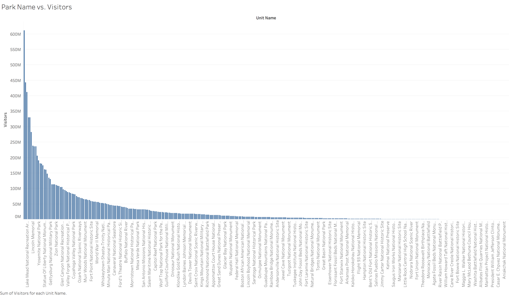
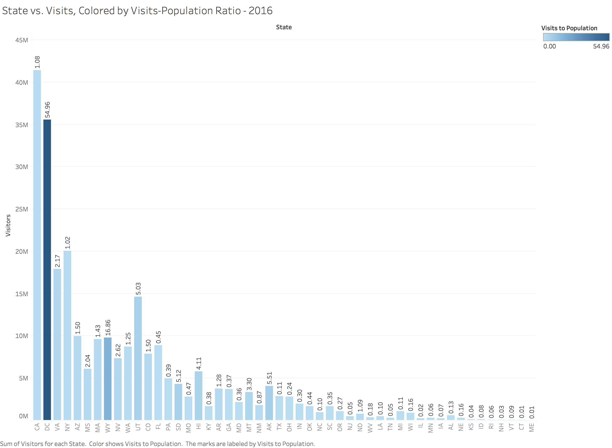

```{r setup, include=FALSE}
knitr::opts_chunk$set(echo = TRUE)
```
<center></center>


#**R Configuration**

Our R Configuration is as follows:
```{r sessionInfo}
sessionInfo(package=NULL)
```

#**Data**
Our original data is [sourced from Data.World](https://data.world/inform8n/us-national-parks-visitation-1904-2016-with-boundaries). This data includes visits by National Parks from 1904-2016. We joined this data with population and gender breakdown by state from the US Census Data. Finally, we joined Latitude and Longitude points for each of the 50 U.S. States, as well as Washington D.C.

#**Initial Analysis**
Our initial analysis was performed in Tableau.

We began by creating a boxplot that showed how national park visits differed by operating region. The below image shows how the National Parks Service breaks its parks into different regions:

<center></center>
 
The boxplot shows:

##**Boxplot: Regions vs. Visits**
<center></center>

##**Scatterplot: Visits vs. Years**
With that info in mind, we created a scatterplot of visits through the years, colored by regions. These trends were then used to create our first Interesting Visualization, which show visit growth through the years.
<center></center>

##**Barchart: Region & State by Visits**
Additionally, we decided to break visits down by both state and region, and create a window average calculation to find the average number of visits between regions, and how each state compared.
<center></center>

##**Barchart: Park Name vs. Visits**
Moving forward, we decided to try and analyze which parks had the highest numbers of visits over this time period. We created the following visualization, and then selected all parks with visits greater than 100 million into a new set. This set was then used to create our second Interesting Visualization.
<center></center>

##**Join: State vs. Visits, Colored by Male-Female Ratio**
We joined data from the U.S. Census that included the number of males, females, and total population for each State. Using this, we created a calculated field that gives the ratio of males to females in each state. The following visualization attempts to find a trend in visits by gender breakdown, though none is immediately obvious:
<center></center>

#**Data.World Pull and ETL Operations**
With our Tableau analysis complete, we pulled the data into R Studio.

##**Data.World Pulls**
First, our initial National Parks Visits data was pulled:
```{r NatVisPull}
source("../01 Data/prETLNatVisPull.R")
```

Next, the Census Data is pulled:
```{r censusPull}
source("../01 Data/censusPull.R")
```

Finally, the Latitude and Longitude information is pulled:
```{r stateLatLongPull.R}
source("../01 Data/stateLatLongPull.R")
```

##**ETL**
Our final task is to perform ETL operations. This includes the removal of blank data, as well as character formatting to better meet our needs for further visualization in R.
```{r ETL}
source("../01 Data/natVisETL.R")
```

The ETL script is available to view in "01 Data," or as an image [here](http://i.imgur.com/zk6lYXI.png).

#**Interesting Visualizations**
##**1: Massive Success of "Mission 66"**
<center></center>

Of note here: first, **National Park visits actually grew during the Great Depression and Great Recession, indicating that visits to these parks aren't considered discretionary spending.** Additionally, it could be that a poor economy has consumers scrambling to find cheaper vacations, and National Parks fill that role. Lastly, stress during difficult economic times may spur people to want to be outdoors and enjoy nature.

However, the most interesting aspect of this is the massive growth experienced in National Parks visits during "Mission 66." **Mission 66 involved a massive amount of infrastructure creation to make parks more accessible.** In addition to roads and trails, it also funded the creation of camping and housing sites, and also an advertising campaign that promoted the natural beauty of these parks to citizens across the country.

##**2: Most Popular States With Most Popular Parks**
<center></center>

This visualization highlights states with parks that have combined visits between 1904-2016 greater than 100 Million, and then lists the single most visited park within that state (in some cases, such as California, there are multiple parks with visits greater than 100 Million).

##**3: Visits to Population Ratio**
<center></center>

This visualization shows visits by state, filtered by year, and colored by the ratio of **visits to state population**. The goal here is to identify states or areas that bring in vastly more visitors than their populations. Washington, D.C., a city with a population of approximately 670,000 people, draws almost 55 times its population in visitors to its National Parks and Monuments. Another state where this occurs is Wyoming, which draws nearly 17 times its population in visits. 

#**Shiny Deployment**
We took the .CSV files produced in our above ETL and Pull operations, and in turn [uploaded them to Data.World](https://data.world/jonathankkizer/s-17-dv-final-project). From there, our Shiny app uses SQL to query relevant data to create a variety of visualizations in R. Our [Shiny deployment](https://jonathankizer.shinyapps.io/DVFinal/) displays the steps taken to reach the interesting visualizations.